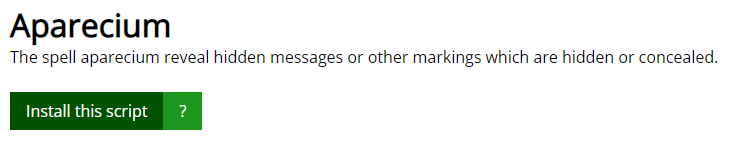

# APARECIUM

**ap·ar·e·ci·um**
_/əˈper ē sē ēəm/_
_noun_

**Aparecium** is the revealing charm, used to reveal hidden messages or other markings which are hidden. It can also counteract a Concealment Charm.

> "She tapped the diary three times and said, "Aparecium!" Nothing happened."
> — Hermione using the spell on Tom Riddle's diary

**What does the spell aparecium do?**
The spell aparecium reveal hidden messages or other markings which are hidden or concealed.

## How to install

Apareciym is built on the [Tampermonkey](https://www.tampermonkey.net/), which is an extremely powerful tool.

### 1. Install Tampermonkey on your browser

- [Chrome](https://www.tampermonkey.net/?ext=dhdg&browser=chrome)
- [Microsoft Edge](https://www.tampermonkey.net/?ext=dhdg&browser=edge)
- [Safari](https://www.tampermonkey.net/?ext=dhdg&browser=safari)
- [Firefox](https://www.tampermonkey.net/?ext=dhdg&browser=firefox)
- [Opera](https://www.tampermonkey.net/?ext=dhdg&browser=opera)
- [Dolphin](https://www.tampermonkey.net/?ext=dhdg&browser=dolphin)
- [UC](https://www.tampermonkey.net/?ext=dhdg&browser=ucweb)

Not much to say about how to install Tampermonkey here, there are too many guides on the internet

### 2. Install Aparecium

Once you have Tampermonkey installed, you can install Aparecium with one click via [Greasy Fork](https://greasyfork.org/scripts/444104).

Just click the **install** button.

Now in the Tampermonkey Management Panel you will see that Aparecium has been successfully installed.

The Aparecium spell will be executed **automatically** when you open unsw cse cgi!
